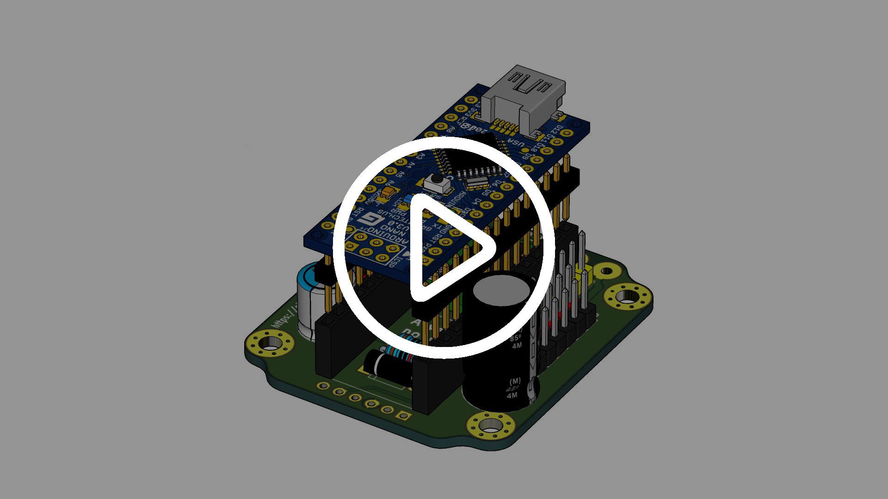

# PacifistaBot: Kit Humanoide de iniciación

Este Kit está pensado para todo aquel que quiera iniciarse en la competición de humanoides.

Está pensado para ser de fácil montaje y programación, ya que está creado en su totalidad a base de impresión 3D y se programa desde un Arduino Nano.

Además las soldaduras necesarias para el montaje de su placa controladora son muy simples.

Hay que destacar también que, aunque su diseño inicial esté inspirado en los robots Pacifistas de la serie One Piece, el diseño es totalmente personalizable ya que tanto las manos y la cabeza, como los detalles decorativos de su pecho y piernas son totalmente modificables e intercambiables para conseguir un robot único.

## Placa Controladora y Batería

Al constar de solo 12 Servos o ejes de libertad, es posible controlarlo fácilmente con tan solo un Arduino Nano, sin necesidad de usar otras placas expansoras y tan solo es necesario alimentar los Servos con una tensión suficiente mediante nuestra placa diseñada a medida, ya que el Arduino por si solo no podría proporcionar la corriente suficiente para mover todos los Servos por si solo.

La batería con la que funciona es una LiFe de 1100 mAh y 2S que le proporcionará en torno a unos 20 minutos de autonomía: tiempo suficiente para toda una competición de Humanoides entera. Aunque, solo con quitar los tornillos de su tapa trasera, es muy simple y rápido reemplazar la batería LiFe por otra cargada en caso de emergencia.

## Elección de Servos

Además de por bastante plastico, PacifistaBot está compuesto de 12 servos MG996R con pletinas de metal. Estos son unos servo de gran fuerza, unos 15KG, con un precio bastante asequible. Hemos seleccionado estos servos por su relación precio/fuerza y porque, al ser tamaño estandar, el diseño sería compatible con gran variedad de servos con prestaciones mucho más avanzadas para aquellos que quieran alcanzar un nivel más alto con este Kit. De esta forma, en caso de querer montar otro tipo de servos, el diseño sería completamente compatible con ellos.

## Comunicación

El control remoto con el robot se hará mediante Bluetooth usando un módulo HC-05 o HC-06 para Arduino y desde cualquier teléfono conectandose al módulo Bluetooth, sin necesidad de ningún tipo de mando. Actualmente existe una gran variedad de aplicaciones, tanto para Android como para iOS que permiten conectarse por Bluetooth a uno de estos módulos y enviarles información y, dependiendo del carácter que se le envíe al Arduino, el robot realizará una acción u otra.

Pronto estará disponible también una aplicación personalizada y orientada específicamente para PacifistaBot (en cierto modo similar a <a href="http://github.com/robotaleh/PIDfromBT" target="_blank">PIDfromBT</a>
 desde la que se podrán configurar los comandos y los botones para hacer más intuitivo el control del robot.

## Tutorial de Montaje

Demostración del montaje de PacifistaBot paso a paso, buscando la mejor y más facil forma de montar el Kit. En cada paso se muestra el orden de montaje y los materiales necesarios. Además, el orden global de montaje está pensado para comenzar montando las partes más sencillas del robot para familiarizarse con los mecanismos que se repiten a lo largo del montaje partiendo desde una base simple.

##### PRONTO MÁS INFORMACIÓN...